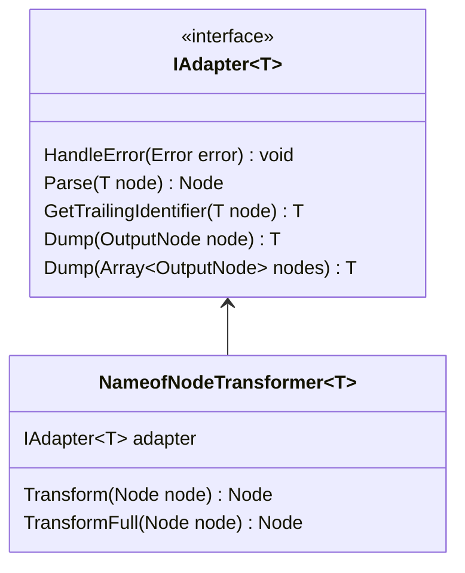
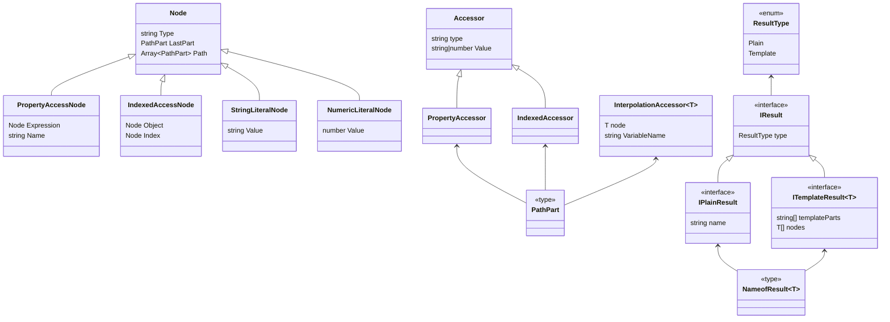

## Plugins

```mermaid
classDiagram
    class BabelTransformer {
        Transform(NodePath path) void
        Visitor
    }

    class BabelPlugin {
        <<type>>
        (BabelAPI babel) : Visitor
    }

    class IErrorHandler {
        <<interface>>
        Process(SourceFile file, Node node, Error error) void
    }

    class TSPatchErrorHandler {
        TSPatchErrorHandler(PluginConfig? config, TransformerExtras? extras)
    }

    class TSJestErrorHandler {
        TSPatchErrorHandler(TsCompilerInstance? compiler)
    }

    class TypeScriptTransformerPlugin {
        TypeScriptTransformerPlugin()
        TypeScriptTransformerPlugin(ErrorHandler errorHandler)
        TypeScript TypeScript
        TransformerFactory~T~ Factory
    }

    class TSLoaderPlugin

    class TSPatchPlugin {
        <<type>>
        (Program program, PluginConfig? config, TransformerExtras? extras) : TransformerFactory~SourceFile~
    }

    class TSPatchTransformerPlugin {
    }

    class TTypeScriptTransformerPlugin {
        <<type>>
        (Program program, getProgram() => Program) : TransformerFactory~SourceFile~
    }

    class TSJestTransformerPlugin {
        number version
        string name
        factory(TsCompilerInstance compilerInstance, object? options) TransformerFactory~SourceFile~
    }

    class TransformerFactory~T~ {
        <<type>>
        (TransformationContext context) : Transformer~T~
    }

    class Transformer~T~ {
        (T node) : T
    }

    IErrorHandler <|-- TSPatchErrorHandler
    TSJestErrorHandler --|> IErrorHandler

    TSPatchErrorHandler --> TSPatchPlugin
    TSJestTransformerPlugin <-- TSJestErrorHandler

    TypeScriptTransformerPlugin <|-- TSPatchTransformerPlugin

    TTypeScriptTransformerPlugin --> TypeScriptTransformerPlugin
    TSJestTransformerPlugin --> TypeScriptTransformerPlugin
    TSPatchTransformerPlugin <-- TSPatchPlugin
    TypeScriptTransformerPlugin <-- TSLoaderPlugin

    TransformerFactory <-- TypeScriptTransformerPlugin

    TransformerFactory --> Transformer
    BabelPlugin --> BabelTransformer
```

## Transformers



## Nodes

