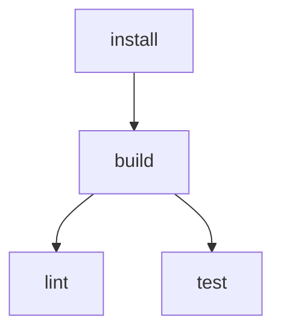
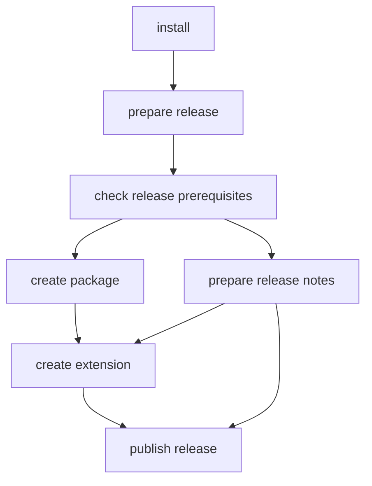
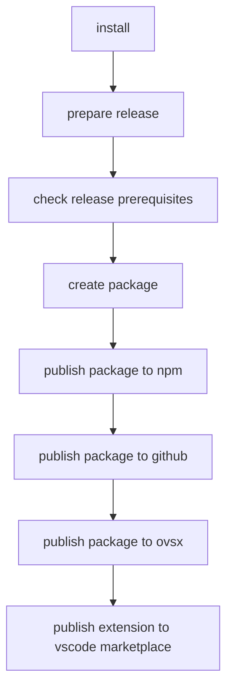

# Pipeline Workflow
## Check

```mermaid
flowchart TD
    install
    build
    lint
    test

    install --> build
    build --> lint
    build --> test
```

## Tag

```mermaid
flowchart TD
    install
    prep["prepare release"]
    prereq["check release prerequisites"]
    pkg["create package"]
    notes["prepare release notes"]
    ext["create extension"]
    publish["publish release"]

    install --> prep
    prep --> prereq
    prereq --> pkg
    prereq --> notes
    pkg --> ext
    notes --> ext
    ext --> publish
    notes --> publish
```

## Deploy

```mermaid
flowchart TD
    install
    prep["prepare release"]
    prereq["check release prerequisites"]
    pkg["create package"]
    npm["publish package to npm"]
    gh["publish package to github"]
    ovsx["publish package to ovsx"]
    ms["publish extension to vscode marketplace"]

    install --> prep
    prep --> prereq
    prereq --> pkg
    pkg --> npm
    npm --> gh
    gh --> ovsx
    ovsx --> ms
```