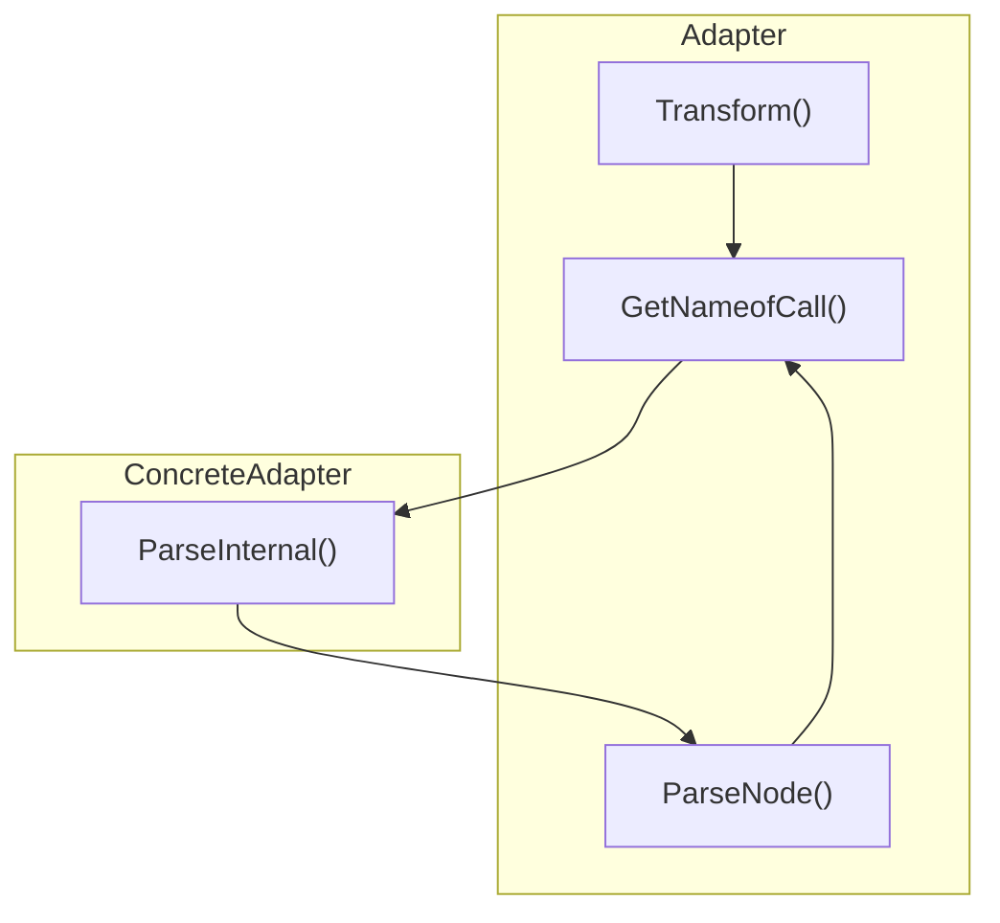
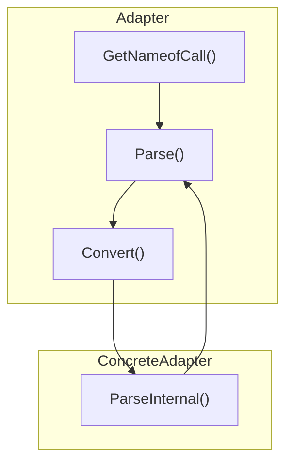

# Transformation
## Original

```mermaid
flowchart TD
    subgraph Adapter
        nameof[GetNameofCall#40;#41;]
        transform[Transform#40;#41;]
        parseNode[ParseNode#40;#41;]
    end

    subgraph ConcreteAdapter
        parseInternal[ParseInternal#40;#41;]
    end

    transform --> nameof
    nameof --> parseInternal
    parseNode --> nameof
    parseInternal --> parseNode
```

## New

```mermaid
flowchart TD
    subgraph Adapter
        nameof[GetNameofCall#40;#41;]
        parse[Parse#40;#41;]
        convert[Convert#40;#41;]
    end

    subgraph ConcreteAdapter
        parseInternal[ParseInternal#40;#41;]
    end

    nameof --> parse
    parse --> convert
    convert --> parseInternal
    parseInternal --> parse
```

Convert()  
    -> ParseNode()  
        -> ParseInternal()  
        -> WrapError?  
    -> NodeToInterpolation?  
    -> NodeToAbstract  
